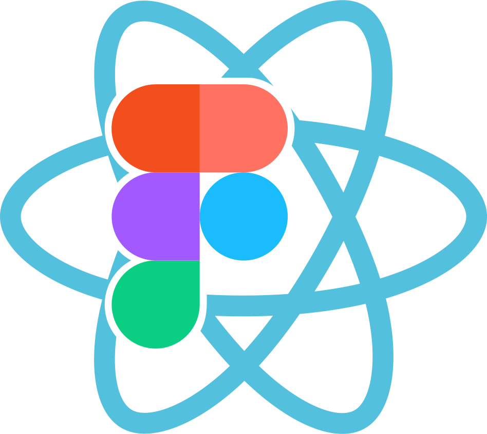

# React Figma



[](https://www.npmjs.com/package/react-figma)
[](https://circleci.com/gh/react-figma/react-figma)

A React renderer for [Figma](https://www.figma.com). Use React components as a source for your designs.

* 🍬 Compatible with [react-native](https://facebook.github.io/react-native/), [react-sketchapp](https://github.com/airbnb/react-sketchapp), [react-primitives](https://github.com/lelandrichardson/react-primitives) API.
* 🦄 Flexible layouts support with [Yoga Layout](https://yogalayout.com/).
* ♻️ Hydration and [HMR](https://webpack.js.org/concepts/hot-module-replacement/) support.
* ⚙️ Built on [Figma Plugin API](https://www.figma.com/plugin-docs/intro/).
* 🚫 **Is not a code generator**.

<p align="center"></p>

Example of code:

```javascript
import * as React from 'react';
import { Page, View, Text } from 'react-figma';

export const App = () => {
    return (
        <Page name="New page" isCurrent>
            <View>
                <View style={{ width: 200, height: 100, backgroundColor: '#dd55aa' }} />
                <Text style={{ color: '#ffffff' }}>text</Text>
            </View>
        </Page>
    );
};
```

## Installation


#### From scratch

Install it with yarn:

```
yarn add react react-figma
```

Or with npm:

```
npm i react react-figma --save
```

### Usage

#### Configure main thread

```javascript
import { setupMainThread } from 'react-figma/rpc';

figma.showUI(__html__, { visible: false });

setupMainThread();
```

#### Configure ui thread

```javascript
import * as React from 'react';
import { App } from './App';

import 'react-figma/rpc';
import { render } from 'react-figma';

render(<App />);
```

#### Import components

```javascript
import * as React from 'react';
import { Page, Rectangle, Text } from 'react-figma';

export const App = () => {
    return (
        <Page name="New page">
            <Rectangle style={{ width: 200, height: 100, backgroundColor: '#dd55aa' }} />
            <Text characters="text" style={{ color: '#ffffff' }} />
        </Page>
    );
};
```
